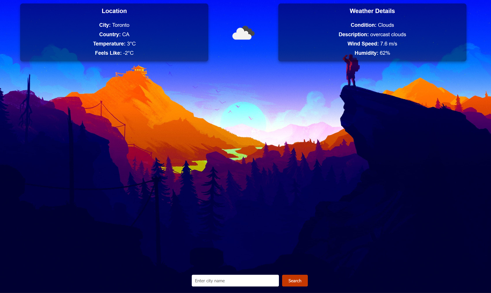
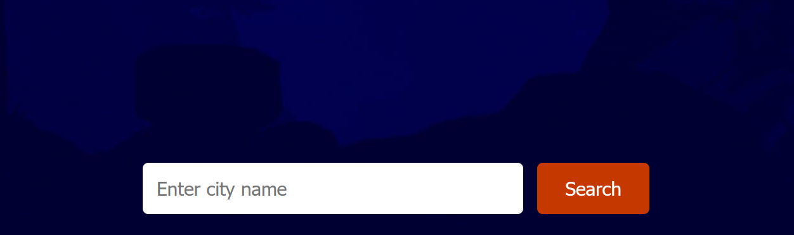

# Zach's Weather App

A simple, user-friendly weather application built with ReactJS. This app allows users to search for a city and view the current weather conditions, including temperature, weather description, and more. The app fetches real-time data from the OpenWeatherMap API.
## Features

    Displays current weather data for any city, including:
        City name and country
        Temperature (in °C)
        Feels-like temperature
        Weather conditions (e.g., Clouds, Rain)
        Humidity and wind speed
        A weather icon representing the current condition
    Search functionality to look up weather by city.
    Responsive design with a visually appealing background and transparent data display.

## Technologies Used

    ReactJS: Frontend framework.
    Axios: For fetching data from the OpenWeatherMap API.
    CSS: For styling, including flexbox for layout and hover effects.

## Usage

    Enter a city name in the search bar at the bottom of the page.
    Click the "Search" button.
    The app will display the weather data for the entered city at the top of the page.

## Screenshots
#### Homepage

#### Search Example

